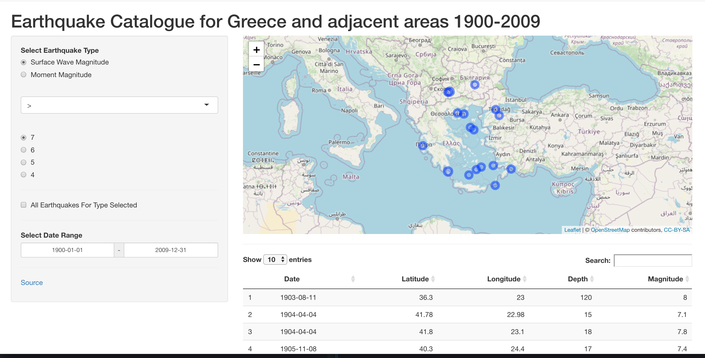

### Earthquakes Shinyapp

A Shiny App to visualise a list of earthquakes enabling user to filter Magnitute and time window. For this case a list of earthquakes is used that occured in Greece and adjacent areas during 1900-2009.



You can run the app locally with Docker

```
docker build -t earthquakes-shinyapp .
docker run -p 8180:8180 earthquakes-shinyapp
```